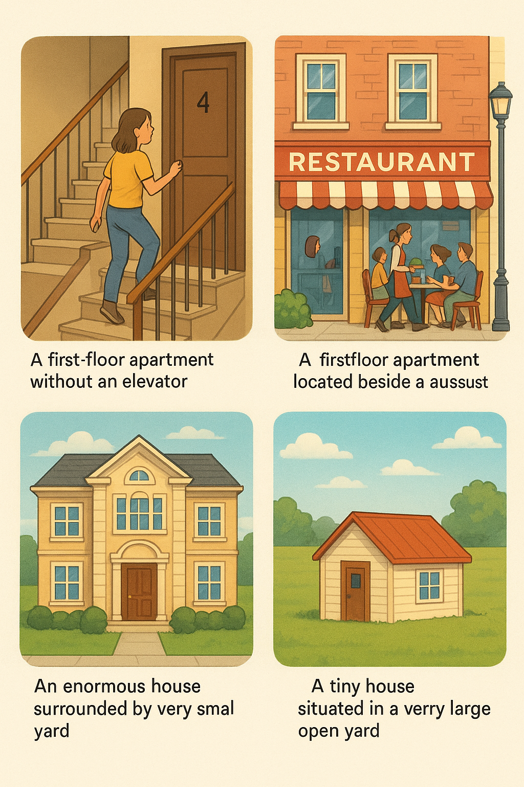
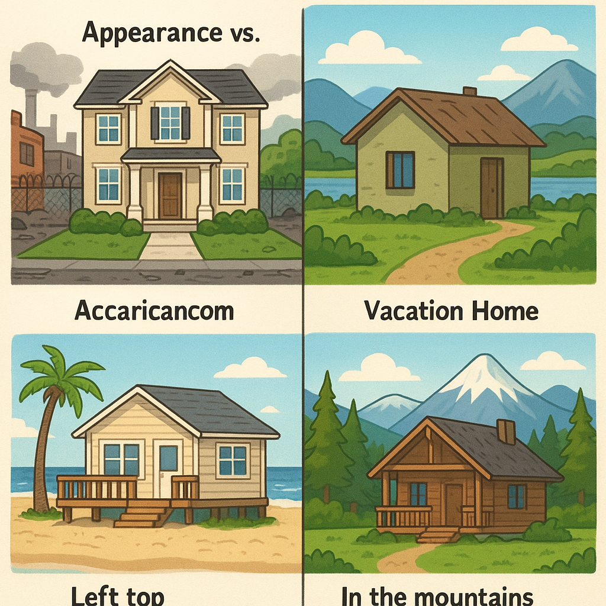

### 1) Kirish savoli: 
Yashash joyi hayotda qanchalik muhim?

### 2) Reading Text
**Aziza**: Salom, Alisher! Bugun ijara narximizni ko‘tarish haqidagi xabarni eshitdingmi?

**Alisher**: Salom, Aziza. Ha, eshitdim. 75% ko‘tarilishi juda adolatsiz! Biz bu kvartirada yillar davomida yashadik, hech qanday yaxshilanish yo‘q.

**Aziza**: Ha, men ham bunga qo‘shilaman. Lekin ishimiz juda band, ko‘chishga vaqtimiz yo‘q. Shunchaki qabul qilsak, ajablanaman?

**Alisher**: Qabul qilmasligimiz kerak! Agar hozir buni qabul qilsak, keyinchalik yanada yuqori narxlar to‘lanishi mumkin. Bu shaharni ko‘rib tursak, xavfsizlik muammolari ham bor.

**Aziza**: Ha, haqiqatda! Kriminal holatlar ko‘paymoqda va ko‘chamizda shovqin ko‘p. Shu sabablarga ko‘ra, boshqa joyni qidirishimiz kerakmi?

**Alisher**: Bilmadim, lekin boshqa joylarga ko‘chish ham o‘z qiyinchiliklarini keltirishi mumkin. Mahallamizdagi maktablar yaxshi, bizning jamoamiz ham juda mos tushadi.

**Aziza**: Ha, ammo ko‘chishimiz kerak bo‘lsa, yangi joyda maktablar, do‘konlar va xizmatlar haqida o‘ylashimiz kerak.

**Alisher**: To‘g‘ri, yangi joyda sport va dam olish imkoniyatlari ham muhimdir. Qanday qilib yangi kvartira topamiz?

**Aziza**: Katta muammolar bo‘lishi mumkin, lekin biz bu masalani birgalikda hal qilishimiz kerak.

**Alisher**: Xo‘p, qarorimizni qabul qilaylik. Biror joy topishga harakat qilaylik. Yangi imkoniyatlar sermahsul bo‘lishi mumkin.

**Aziza**: Ha, men ham shunga ishonaman. Keling, tezda joy qidirishni boshlaymiz!

### 3) Lug‘at (mini‑glossary)
- **ijara** — uyni vaqtincha pul to‘lab turish
- **ko‘tarilish (75%)** — narxning oshishi
- **kvartira** — ko‘p qavatli uyda mustaqil xonadon
- **ko‘chish** — yashash joyini o‘zgartirish
- **xavfsizlik/kriminal** — jinoyat darajasi past/yoki yuqori bo‘lishi
- **shovqin** — baland ovoz, tinchlikning yo‘qligi
- **jamoa/mahalla** — qo‘ni‑qo‘shnilar, ijtimoiy muhit
- **xizmatlar** — do‘konlar, poliklinika, transport, bog‘cha, maktab va h.k.
- **imkoniyatlar** — sport, dam olish, kurslar, ish o‘rinlari va b.

### 4) Speaking Discussion
Yashash joyini tanlashda qaysi omillar muhim?

- mahalliy maktablar
- jinoyatchilik darajasi
- bog‘lar va yashil hududlar
- tungi hayot (klublar, kafelar va hokazo)
- yaqin atrofdagi do‘konlar
- tirbandlik (yo‘l harakati)
- jamoat transporti
- sport va hordiq chiqarish maskanlari
- ish imkoniyatlari

### 5) Orzuingdagi uy
- Qayerda bo‘lardi?
- Qanday turdagi uy yoki kvartira bo‘lardi?
- Unda qanday maxsus qulayliklar bo‘lardi?

### 6) Tanlov mashqi
Bitta variantni tanla va nima uchun shunday tanlaganingni tushuntir.  
Agar tanlashga to‘g‘ri kelsa…

- **Qayerda yashash**: Kichik shaharche (suburb)da yashashni xohlaysanmi yoki poytaxt markazidami?
- **Qo‘shnilar turi**: Qo‘shni sifatida besh farzandli juftliknimi yoki besh itli juftliknimi?

- **Kvartira holatlari**: Lift bo‘lmagan to‘rtinchi qavatdami yoki yonida restoran bo‘lgan birinchi qavatdami?
- **Uy kattaligi va hovli kattaligi**: Katta uy, lekin juda kichik hovlimi yoki kichkina uy, lekin juda katta hovlimi?

- **Uy ichidagi qulayliklar**: Sport zaliga ega uymi yoki o‘yin xonasi bo‘lgan uymi?
- **Isitish turi**: Markaziy isitishnimi yoki pechka (kamin)nimi?

- **Ko‘rinish va joylashuv**: Chiroyli uy, lekin xunuk hududdami yoki xunuk uy, lekin chiroyli hududdami?
- **Dam olish uyi**: Dengiz bo‘yidagi dam olish uyi yoqadimi yoki tog‘dagi dam olish uyi?

### 7) Rasmlar

